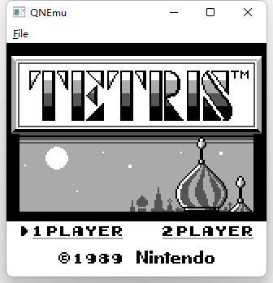

# QNEmu

QNEmu is an emulator that support Nintendo Game Boy and Game Boy Color. It is still under development and plans to support other consoles in the future. The main purpose of this project is to study computer architecture and software design pattern.

## Build

Requirements:
- GCC >= 9
- CMake >= 3.13
- Qt >= 6.2
- Google Test >= 1.10

Build command:

    mkdir build && cd build
    cmake .. && make

The executable will be available in qneme/qnemu. To run the test:

    make test

## Play

Just click the executable and load Rom file.

### Key binding

| Joypad | Key |
| ------ | ----|
| ↑      | W   |
| ↓      | S   |
| ←      | A   |
| →      | D   |
| Start  | 3   |
| Select | 2   |

## Functions & Features

### GameBoy & GameBoy Color

| Function  | Implement | Test   |
| --------- | --------- | ------ |
| CPU       | ✅       | manual |
| PPU       | ✅       | manual |
| Sound     | ❌       | ❌    |
| Interrupt | ✅       | ✅    |
| Joypad    | ✅       | ✅    |
| Timer     | ✅       | ✅    |
| no MBC    | ✅       | ✅    |
| MBC1      | ✅       | ✅    |
| MBC2      | ❌       | ❌    |
| MBC3      | ❌       | ❌    |
| MBC5      | ❌       | ❌    |
| MBC6      | ❌       | ❌    |
| MBC7      | ❌       | ❌    |
| HuC1      | ❌       | ❌    |
| HDMA      | ✅       | ❌    |

| Feature         | Implement | Test |
| --------------- | --------- | ---- |
| key remap       | ❌       | ❌   |
| Save & Load     | ❌       | ❌   |
| Filtering       | ❌       | ❌   |
| Vulkan backend  | ❌       | ❌   |
| DirectX backend | ❌       | ❌   |
| Speed setting   | ❌       | ❌   |

## Thanks

- [Pan Doc](https://gbdev.io/pandocs/)
- [Visual Boy Advance - M](https://github.com/visualboyadvance-m/visualboyadvance-m)
- [mGBA](https://github.com/mgba-emu/mgba)
- [Coffee GB](https://github.com/trekawek/coffee-gb)
